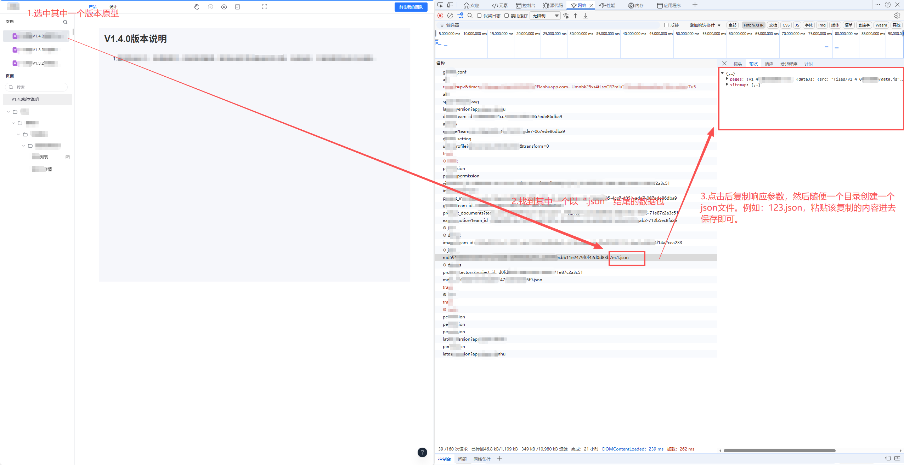

# LanhuToPng

蓝湖原型转 PNG/PDF 工具 - 自动下载蓝湖原型 HTML 并转换为高清 PNG 截图或 PDF 文档

  

## ✨ 功能特性

- 🖼️ **图形界面** - 简单易用，无需命令行
- 🚀 **自动下载** - 从蓝湖 API 自动下载真实原型
- 📸 **批量转换** - 一键转换所有页面为 PNG 截图
- 📄 **PDF 生成** - 将所有 PNG 合并为单个 PDF 文档
- ⚡ **并发处理** - 支持多任务并发，速度快
- 🎨 **高清截图** - 支持 2K/4K 分辨率和 Retina 质量
- 🔧 **灵活配置** - 自定义尺寸、缩放、并发数等
- 🎯 **智能过滤** - 自动过滤导航页面

## 🚀 快速开始

### 方式一：直接使用（推荐）

1. **双击 `LanhuToPng-快速运行脚本.bat`** 启动程序（首次会自动编译）
2. 点击"浏览"选择蓝湖导出的 JSON 文件
   - Json可以通过浏览器抓取蓝湖的数据包获取
     - 
     - 1. 按F12打开开发者工具，选择网络（NetWork）
       2. 选择某一个版本原型
       3. 找到其中一个以“.json”结尾的数据包
       4. 点击复制到一个“.json”的文件中
3. 点击"浏览"选择输出目录
4. 点击"一键完成"（自动完成下载、PNG 转换、PDF 生成）

### 方式二：创建桌面快捷方式

1. **双击 `创建桌面快捷方式.bat`**
2. 以后直接双击桌面图标启动

## 🎛️ 操作按钮说明

- **1. 下载 HTML** - 仅从蓝湖下载原型 HTML 文件
- **2. 转换 PNG** - 将 HTML 转换为 PNG 截图
- **3. 转换 PDF** - 将 PNG 合并为单个 PDF 文档
- **一键完成** - 自动完成所有步骤（下载 → PNG → PDF）

## 📦 分发给其他人

### 打包分发版本

**双击 `打包分发版本.bat`**

会自动创建 `LanhuToPng_分发版` 文件夹，包含：
- `JsonToPngConverter.exe` - 主程序（约 70-80MB）
- `override.zip` - 资源包（必需）
- `使用说明.txt` - 使用指南

将整个文件夹压缩成 zip 即可分发。

### 接收者使用

1. 解压文件夹
2. 双击 `JsonToPngConverter.exe`
3. 首次运行会自动下载 Chromium（约 150MB）

**重要**: `JsonToPngConverter.exe` 和 `override.zip` 必须在同一目录！

## 🎛️ 配置说明

### 并发数（1-10）
同时处理的任务数量
- 默认：3
- 推荐：3-5
- 过高可能导致 API 限流

### 截图尺寸
- **1366 x 768** - 笔记本常见分辨率
- **1920 x 1080** - Full HD（默认）
- **2560 x 1440** - 2K
- **3840 x 2160** - 4K

### 缩放因子（1-4）
- **1** - 标准质量
- **2** - 高清质量（默认，推荐）
- **3-4** - 超高清质量（文件较大）

### 截取整个页面
- ✅ 勾选：截取完整页面（包括滚动区域）
- ⬜ 不勾选：只截取可见区域

## 💻 命令行模式

适合脚本自动化和批量处理：

```batch
# 下载 HTML
JsonToPngConverter.exe data.json output --download --concurrency 3

# 转换 PNG
JsonToPngConverter.exe output\html output\png --width 1920 --height 1080 --scale 2

# 生成 PDF
JsonToPngConverter.exe output\png output\原型截图.pdf --pdf
```

### 命令行参数

| 参数 | 说明 | 默认值 |
|------|------|--------|
| `--download` | 从蓝湖下载 HTML | - |
| `--pdf` | 生成 PDF 文档 | - |
| `--width` | 截图宽度（像素） | 1920 |
| `--height` | 截图高度（像素） | 1080 |
| `--concurrency` | 并发数量 | 5 |
| `--scale` | 缩放因子 | 2 |
| `--timeout` | 超时时间（毫秒） | 30000 |
| `--no-full-page` | 不截取整页 | - |

## 📄 JSON 文件格式

蓝湖导出的 JSON 文件示例：

```json
{
  "pages": {
    "页面1.html": {
      "mapping_md5": "abc123...",
      "name": "页面1"
    },
    "页面2.html": {
      "mapping_md5": "def456...",
      "name": "页面2"
    }
  }
}
```

**关键字段**: `mapping_md5` - 蓝湖 API 的文件标识（必需）

## 📁 输出结构

```
输出目录/
├── html/              # 下载的 HTML 文件
│   ├── 页面1.html
│   ├── 页面2.html
│   └── resources/     # 资源文件
├── png/               # 转换的 PNG 截图
│   ├── 页面1.png
│   └── 页面2.png
└── 原型截图.pdf       # 合并的 PDF 文档
```

## 📂 项目结构

```
LanhuToPng/
├── LanhuToPng-快速运行脚本.bat  # 🚀 启动程序（主要使用）
├── 重新编译.bat                 # 🔧 重新编译（修改代码后使用）
├── 创建桌面快捷方式.bat         # 🔗 创建桌面快捷方式
├── 打包分发版本.bat             # 📦 打包分发包（自动发布+打包）
├── override.zip                # 📄 资源包（必需）
├── README.md                   # 📖 本文档
├── .gitignore                  # 🚫 Git 忽略文件
└── src/                        # 💻 源代码
    ├── MainForm.cs             # GUI 界面
    ├── LanhuDownloader.cs      # 下载器
    ├── HtmlToImageConverter.cs # PNG 转换器
    ├── PdfConverter.cs         # PDF 转换器
    ├── Program.cs              # 程序入口
    ├── ConverterConfig.cs      # 配置类
    ├── SimpleCli.cs            # 命令行接口
    └── JsonToPngConverter.csproj
```

## 🎯 脚本说明

### LanhuToPng-快速运行脚本.bat（主要使用）
- 启动程序
- 首次运行会自动编译
- 之后直接启动 GUI
- 最常用的脚本

### 重新编译.bat
- 重新编译项目
- 清理旧文件
- 还原 NuGet 包

**使用场景**: 修改了源代码、添加了新功能、编译出错需要重新编译

### 创建桌面快捷方式.bat
- 在桌面创建快捷方式
- 自动检测并编译（如需要）

**使用场景**: 首次安装后创建快捷方式，方便日常使用

### 打包分发版本.bat
- 打包分发包
- 自动发布独立版本（如需要）
- 复制 exe 和资源文件
- 创建使用说明

**使用场景**: 需要分发给其他人，创建可独立运行的版本

## 🔄 工作流程

### 开发者工作流程

1. **首次使用**
   ```
   双击 LanhuToPng-快速运行脚本.bat
   → 自动编译
   → 启动程序
   ```

2. **修改代码后**
   ```
   双击 重新编译.bat
   → 重新编译
   → 双击 LanhuToPng-快速运行脚本.bat 启动
   ```

3. **分发给其他人**
   ```
   双击 打包分发版本.bat
   → 自动发布独立版本
   → 创建分发包
   → 压缩 LanhuToPng_分发版 文件夹
   → 发送给其他人
   ```

### 普通用户工作流程

1. **首次使用**
   ```
   双击 创建桌面快捷方式.bat
   → 创建桌面快捷方式
   ```

2. **日常使用**
   ```
   双击桌面快捷方式
   → 启动程序
   ```

## ⚙️ 系统要求

- **操作系统**: Windows 10/11 64位
- **.NET**: 10.0 SDK（开发）或无需安装（使用分发版）
- **磁盘空间**: 至少 500MB（Chromium + 输出文件）
- **网络**: 需要连接互联网下载原型

## 🔧 技术栈

- **.NET 10.0** - 应用框架
- **WinForms** - 图形界面
- **PuppeteerSharp 11.0.0** - 浏览器自动化
- **PdfSharp 6.2.0** - PDF 生成
- **Newtonsoft.Json** - JSON 解析
- **Chromium** - 无头浏览器

## ❓ 常见问题

### Q: 程序无法启动？
**A**: 确保已安装 .NET 10.0 SDK，或使用"打包分发版本"生成独立版本

### Q: 首次运行很慢？
**A**: 首次运行会自动下载 Chromium 浏览器（约 150MB），请耐心等待

### Q: 下载失败？
**A**: 
- 检查网络连接
- 降低并发数（改为 1-2）
- 确认 JSON 文件格式正确
- 检查 `mapping_md5` 字段是否存在

### Q: PNG 文件太大？
**A**: 
- 降低缩放因子（改为 1）
- 减小截图尺寸（如 1366x768）
- 不勾选"截取整个页面"

### Q: PDF 生成失败？
**A**: 
- 确保 PNG 文件已生成
- 检查 PNG 目录是否存在
- 查看日志中的错误信息

### Q: PDF 文件太大？
**A**: 
- 降低 PNG 的缩放因子
- 减小截图尺寸
- 使用 PDF 压缩工具进一步压缩

### Q: 某些页面转换失败？
**A**: 
- 查看日志中的错误信息
- 检查 HTML 文件是否完整
- 尝试增加超时时间（命令行模式）

### Q: 只给别人 exe 文件可以吗？
**A**: 不可以！必须同时提供 `JsonToPngConverter.exe` 和 `override.zip` 两个文件

### Q: 修改代码后程序没有变化？
**A**: 运行 `重新编译.bat` 重新编译

### Q: 如何分发给其他人？
**A**: 运行 `打包分发版本.bat`，然后压缩生成的文件夹

### Q: 如何创建桌面快捷方式？
**A**: 运行 `创建桌面快捷方式.bat`

### Q: 如何批量处理多个项目？
**A**: 使用命令行模式，编写批处理脚本自动化处理

## 📝 使用示例

### 示例 1：基本使用（GUI）
```batch
# 启动 GUI
LanhuToPng-快速运行脚本.bat

# 在界面中：
# 1. 选择 JSON: D:\Projects\lanhu\project.json
# 2. 选择输出: D:\Projects\lanhu\output
# 3. 点击"一键完成"
```

### 示例 2：命令行完整流程
```batch
# 1. 下载 HTML
JsonToPngConverter.exe data.json output --download

# 2. 转换 PNG
JsonToPngConverter.exe output\html output\png

# 3. 生成 PDF
JsonToPngConverter.exe output\png output\原型截图.pdf --pdf
```

### 示例 3：批量处理多个项目
```batch
# 处理多个项目
for %%f in (D:\Projects\*.json) do (
    JsonToPngConverter.exe "%%f" "D:\Output\%%~nf" --download
    JsonToPngConverter.exe "D:\Output\%%~nf\html" "D:\Output\%%~nf\png"
    JsonToPngConverter.exe "D:\Output\%%~nf\png" "D:\Output\%%~nf\原型截图.pdf" --pdf
)
```

### 示例 4：高清 PDF
```batch
# 4K 高清截图 + PDF
JsonToPngConverter.exe input\html output\png --width 3840 --height 2160 --scale 2
JsonToPngConverter.exe output\png output\高清原型.pdf --pdf
```

## 🤝 贡献

欢迎提交 Issue 和 Pull Request！

## 📄 许可证

MIT License

---

**开发**: 2026 
**版本**: 1.0  
**更新**: 2026-01-29
